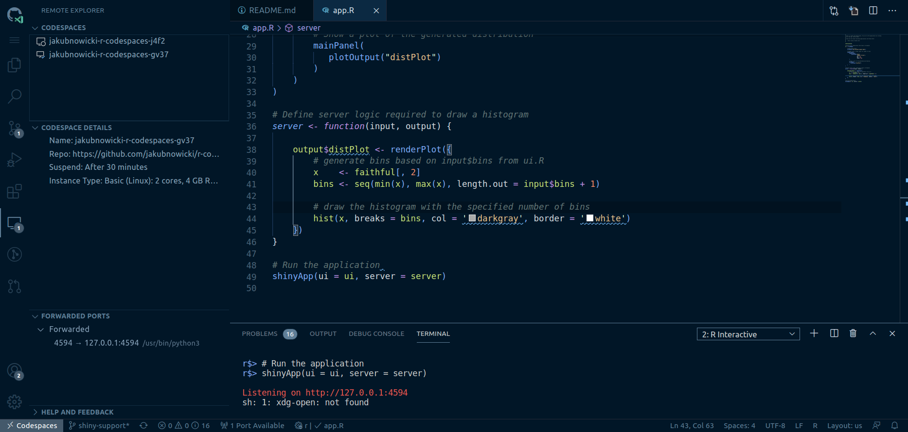

# GitHub Codespaces configuration for R

This repository contains a basic configuration that allows working with R in [GitHub Codespaces](https://github.com/features/codespaces).
It is based on official Github Codespaces [dev container for R](https://github.com/microsoft/vscode-dev-containers/tree/master/containers/r).
It includes [`R`](https://marketplace.visualstudio.com/items?itemName=Ikuyadeu.r) and
[`R LSP Client`](https://marketplace.visualstudio.com/items?itemName=REditorSupport.r-lsp) VSCode extensions.
It comes with `renv` setup which includes `languageserver` package required to enable the latter extension.
To install it, open R in Codespaces console and type `renv::restore()`.

## Adjusting configuration to your needs

### Different R version

This configuration is based on `rocker/r-ver:4.0.0-ubuntu18.04` Docker image with installed dependencies required by `languageserver` package.
You can change that and replace the current image with the one of your choice in `.devcontainer/Dockerfile`.
Check [rocker repositories](https://hub.docker.com/u/rocker) for available options.

Remember that current Dockerfile is suited for images based on Ubuntu.

### Installing R packages

I strongly recommend using [`renv`](https://rstudio.github.io/renv/index.html) when it comes to setting your working environment in R.
This configuration comes with initalized workspace but you can easily create your own one. Just remember that `languageserver` is required for `R LSP Client` extension to work (it needs to be installed, adding to `renv.lock` file is optional).

`renv` configuration set here as default comes with (already mentioned) `languageserver`, `lintr` and `styler` packages. To enable detection by `renv`, all three are included in `develop_packages.R` file. This way you can run `renv::snapshot()` without setting any additional option like `type = "all"` and include them in your R environment setup.

### Adding VSCode extensions

Besides extensions for R, this configuration includes a few additional ones that can be helpful in development.
You can add additional extensions in `.devcontainer/devcontainer.json` file in "extensions" section.

### Running Shiny applications

R extension allows running Shiny applications from Codespaces. To do that,
follow these steps (you can use sample Shiny [Old Faithful app](./docs/examples/app.R)):

1. Install `shiny` and all R dependencies required by your app by opening R in Codespace console.
1. You will need an entry file.
     * In single file apps it is just the same
file as the app (`shinyApp(ui = ui, server = server)` at the end of the file).
    * In multiple files app you need an additional file with
    `shiny::runApp(appDir = "app_dir")` function that points to the app directory.
1. Run this file with `R: Run soure with echo` command (shortcut: Ctrl/Cmd + Shift + Enter)
1. App will be available at a specific port. You can set it as function argument
(eg. `shiny::runApp(appDir = "app+dir", port = 8888)`) or leave it so it
will be chosen randomly. Now you need to forward that port so you can access
the app in your browser. VSCode Remote extension is super handy here. It
will list all available ports and you can forward them just by a single click.

1. Enjoy playing with your app!
