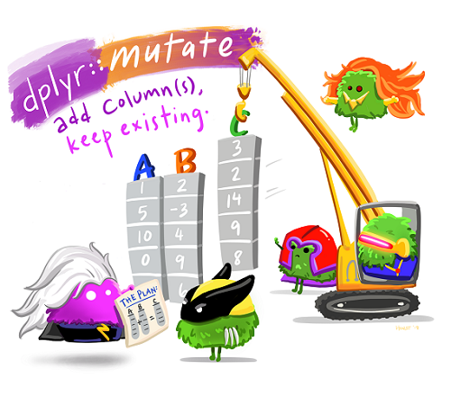
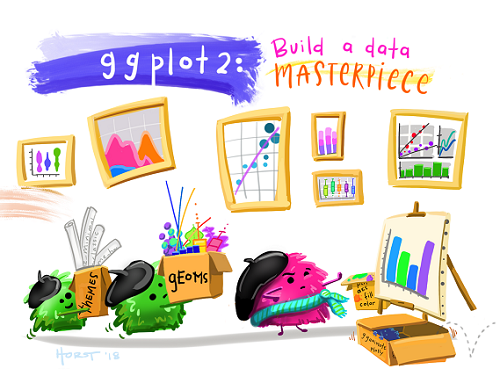

# Explore and analyze data with R


```{r eval=FALSE, include=FALSE}
install.packages(c('tidyverse', 'patchwork', 'paletteer', 'statip', 'summarytools'))
```

##install prerequisties 
```{r eval=False, include=FALSE}
install.packages(c('rmarkdown', 'tidyverse', 'tidymodels', 'glmnet', 'plotly', 'conflicted', 'randomForest', 'xgboost', 'patchwork', 'paletteer', 'statip', 'summarytools', 'kableExtra', 'here'))
```

```{r setup, include=FALSE}
library(tidyverse)
library(glue)
library(kableExtra)
library(patchwork)
library(scales)
library(summarytools)
```

## Buckle up 👨‍🚀

In this learning path, we'll learn how to create Machine learning models using `R` 😊. Machine learning is the foundation for predictive modeling and artificial intelligence.We'll learn the core principles of machine learning and how to use common tools and frameworks to train, evaluate, and use machine learning models.

Modules that will be covered in this learning path include:

-   Explore and analyze data with R

-   *Train and evaluate regression models (under development)*

-   *Train and evaluate classification models (under development)*

-   *Train and evaluate clustering models (under development)*

-   *Train and evaluate deep learning models (under development)*

### **Prerequisites**

This learning path assumes knowledge of basic mathematical concepts. Some experience with `R and the tidyverse` is also beneficial though we'll try as much as possible to skim through the core concepts. To get started with R and the tidyverse , the best place to start would be [R for Data Science](http://r4ds.had.co.nz/) an O'Reilly book written by Hadley Wickham and Garrett Grolemund. It's designed to take you from knowing nothing about R or the tidyverse to having all the basic tools of data science at your fingertips.

This [tutorial](https://learnr-examples.shinyapps.io/ex-setup-r/#section-welcome) will help you set up your computer to use R. It is for you if you need to:

-   Install R on your computer

-   Install the RStudio IDE

-   Install the `tidyverse` R package

You can skip this tutorial if you've already done these things.

We'll require some packages to knock-off this module. You can have them installed as:

`install.packages(c('tidyverse', 'patchwork', 'paletteer', 'statip', 'summarytools'))`

The `Python` edition of the learning path can be found at [this learning path](https://docs.microsoft.com/en-us/learn/paths/create-machine-learn-models/).

### Why R?

> We think R is a great place to start your data science journey because it is an environment designed from the ground up to support data science. R is not just a programming language, but it is also an interactive environment for doing data science. To support interaction, R is a much more flexible language than many of its peers. This flexibility comes with its downsides, but the big upside is how easy it is to evolve tailored grammars for specific parts of the data science process. These mini languages help you think about problems as a data scientist, while supporting fluent interaction between your brain and the computer. - [**R for Data Science**](https://r4ds.had.co.nz/index.html) by Hadley Wickham and Garrett Grolemund

Now, let's get started!

{width="569"}

## Explore and analyze data with R

### Introduction

Unsurprisingly, the role of a data scientist primarily involves exploring and analyzing data. The results of this analysis might form the basis of a report or a machine learning model; but it all begins with data.

> *Machine learning is a subset of data science that deals with predictive modeling. In other words, using data to create models that can predict unknown values. It works by identifying relationships between data values that describe characteristics of something (its features) and the value we want to predict (the label), and encapsulating these relationships in a model through a training process.*

Usually, a data analysis project is designed to establish insights around a particular scenario or to test a hypothesis. For example, suppose a university professor collects data from data science students, including the number of lectures attended, the hours spent studying, and the final grade achieved on the end of term exam. The professor could then take a sample of the data and analyze it to determine if there is a relationship between the amount of study a student undertakes and the final grade they achieve. They might use the data to test a hypothesis that only students who study for a minimum number of hours can expect to achieve a passing grade; or even prepare the data to train a machine learning model that predicts a student's grade based on their study habits.

{width="569"}

## **Exercise - Explore data**

Data exploration and analysis is typically an *iterative* process, in which the data scientist takes a sample of data, and performs the following kinds of task to analyze it and test hypotheses:

-   Clean data to handle errors, missing values, and other issues.

-   Apply statistical techniques to better understand the data, and how the sample might be expected to represent the real-world population of data, allowing for random variation.

-   Visualize data to determine relationships between variables, and in the case of a machine learning project, identify *features* that are potentially predictive of the *label*.

-   Derive new features from existing ones that might better encapsulate relationships within the data.

-   Revise the hypothesis and repeat the process.

Data scientists can use a variety of tools and techniques to explore, visualize, and manipulate data. One of the most common ways in which data scientists work with data is to use the R language and some specific packages for data processing.

The best way to learn about exploring and preparing data is to try it for yourself, so that's what you'll do in this exercise.

## 1. Getting to know R ... a little

I've heard R described as quirky. But quirky is good, it means it's a little bit out of the norm. And I think that's what makes R, R. So to easen things up, we'll briefly discuss some of the most important family of data types in base R: `vectors`.

> In R, **assignment** statements have the following form:
>
> `object_name <- value`
>
> `=` will work in place of `<-`, but it will cause confusion later. Use the keyboard shortcut: `Alt` + `-` (the minus sign) to poof up the assignment operator, \<- , in a flash. 💫

### Atomic vectors

The basic data structure in R is the [vector](https://r4ds.had.co.nz/vectors.html?q=list#vectors) (R's 1D data structure). Vectors come in two flavours: *atomic vectors* and *lists*. The two differ in the types of their elements: all elements of an atomic vector must be the same type, whereas the elements of a list can have different types. There are four primary types of atomic vectors: *logical*, *integer*, *double*, and *character* (which contains strings).

Vectors are created using use [`c()`](https://rdrr.io/r/base/c.html), short for combine. You can determine the type of a vector with [`typeof()`](https://rdrr.io/r/base/typeof.html) and how many elements it contains with [`length()`](https://rdrr.io/r/base/length.html).

```{r}
# Logical vector
lgl_var <- c(TRUE, FALSE)
print(lgl_var)
typeof(lgl_var)

# Double vector: These are special values defined by the floating point standard.
dbl_var <- c(1, 2.5, 4.5)
print(dbl_var)


# Integer vector: written similarly to doubles but must be followed by L
int_var <- c(1L, 6L, 10L)
print(int_var)
length(int_var)


# Character vector
chr_var <- c("these are", "some strings")
chr_var
```

Adding a `dim` attribute to a vector allows it to behave like a 2-dimensional **matrix** or a multi-dimensional **array**.

You can create matrices and arrays with [`matrix()`](https://rdrr.io/r/base/matrix.html) and [`array()`](https://rdrr.io/r/base/array.html), or by using the assignment form of [`dim()`](https://rdrr.io/r/base/dim.html): We'll use `dim` in this walk through. See how to use `matrix` or `array` by typing `?matrix` or `?array` on your RStudio console.

```{r message=F, warning=F}
# Sequence of integers starting from 1 to 6
int_seq <- 1:6
```

For example, you can reorganize `int_seq` into a 2 × 3 matrix (which has 2 rows and 3 columns):

```{r message=F, warning=F}
dim(int_seq) <- c(2,3)
print(int_seq)
```

In R, `data frames` (which we'll cover in just a lil bit), are the most common way of storing and analyzing data. However, vectors too can suffice for general and basic data manipulation

With that said, let's take atomic vectors out for a try!

We'll start by looking at some simple data. Suppose a college takes a sample of student grades for a grades science class:

```{r message=F, warning=F}
# Defining a vector of student grades
grades <-  c(50, 50, 47, 97, 49, 3, 53, 42, 26,
             74, 82, 62, 37, 15, 70, 27, 36, 35,
             48, 52, 63, 64)
print(grades)
```

So, how many students does the sample contain 🗒?

```{r message=F, warning=F}
# Determining number of elements in the vector
length(grades)
```

### **Indexing Vectors**

Oftentimes we may want to access only part of a vector, or perhaps an individual element. This is called *indexing* and is accomplished with square brackets, `[]`. R has a very flexible system that gives us several choices of index:

-   Passing a vector of positive numbers returns the slice of the vector containing the elements at those locations. The `first` position is `1` (not 0, as in some other languages).

-   Passing a vector of `negative numbers` returns the slice of the vector containing the elements everywhere *except* at those locations.

Let's get the first and sixth grade:

```{r message=F, warning=F}
# we should expect 50 & 3
grades[c(1,6)]
```

Perfect! Now let's get a vector of all grades except for the 1st and the 6th student.

```{r message=F, warning=F}
# we should expect all other grades except at index 1 and 6
grades[-c(1,6)]
```

Alright, now we know our way around vectors, enough to knock out this module 💪.

> The chapter [Vectors](https://r4ds.had.co.nz/vectors.html) in `R for Data Science` would be a good place to get you started on all things atomic vectors, lists (which we didn't cover), and a whole lot on base R data structures! Be sure to check it out.

It's time we performed some analysis of the grades data. For a first, we can find the simple average grade (in other words, the *mean* grade value).

```{r message=F, warning=F}
mean(grades)
```

So the mean grade is just around 50 - more or less in the middle of the possible range from 0 to 100.

### **Combining vectors**

Let's add a second set of data for the same students, this time recording the typical number of hours per week they devoted to studying.

```{r message=F, warning=F}
# Defining a vector of study hours
study_hours <- c(10.0, 11.5, 9.0, 16.0, 9.25, 1.0, 11.5, 9.0,
                 8.5, 14.5, 15.5, 13.75, 9.0, 8.0, 15.5, 8.0,
                 9.0, 6.0, 10.0, 12.0, 12.5, 12.0)
```

We can create a 2-dimensional **matrix** from `grades` and `study_hours` by combining the vectors by columns using `cbind()`

```{r message=F, warning=F}
# Create a 2D matrix
student_data <- cbind(study_hours, grades)
print(student_data)
```

Before going into anything complex, we might want to find out the dimensions of our object. Turns out, `dim()` can also help you retrieve the number of rows and columns of an object.

```{r message=F, warning=F}
# Dimension of the resulting matrix [Rows, Columns]
dim(student_data)
```

As expected 🤩, the matrix contains 2 columns each with 22 rows.

We subset matrices using the notation `[row_number,column_number]`

So, for instance, if we wanted to access the first element in the in the first column (study_hours), we would do it as below:

```{r message=F, warning=F}
# Show the first element of the first column
student_data[1, 1]
```

Accessing all the elements in the first row would also follow a similar fashion:

```{r message=F, warning=F}
# Show all columns in the first row
student_data[1,]
```

Now we have a multidimensional array containing both the student's study time and grade information, which you can use to compare data. For example, how does the mean study time compare to the mean grade?

```{r message=F, warning=F}
# Get the mean value of each subvector in the matrix
avg_study <- mean(student_data[, 1])
avg_grade <- mean(student_data[, 2])

# Format strings using package 'glue'
library(glue)
glue(
  'Average study hours: {format(round(avg_study, 2), nsmall = 2)}
  Average grade: {format(round(avg_grade, 2), nsmall = 2)}')
```

### **Analysis using atomic vectors and matrices? Not so fast...** 🤷

One shortcoming of atomic vectors and matrices is that they can only hold one mode of data; they don't allow us to mix, say, numbers and character strings. If we try to do so, it will change the mode of the other elements in the vector to conform. Let's see this in action:

```{r message=F, warning=F}
# Modifying grades by adding a character string "22"
grades_mod1 <- c(grades, "22")

# Adding a character tranforms `grades` to a character vector
typeof(grades_mod1)
```

Let's take a look at the fine print!

```{r message=F, warning=F}
# Modified grades
print(grades_mod1)

# Original grades
print(grades)
```

From the `print()` output, we can notice that the numbers got changed to character values so that the vector could accommodate all the elements we passed to the `c()` function. As such, further analysis like finding the mean would be quite a pain to say the least!

```{r}
mean(grades_mod1)
```

In R, a special object known as a `data frame` resolves this problem 🦸.

## 2. A glimpse into the tidyverse {width="25"}

### Data frames and tibbles

Data frames are one of the biggest and most important ideas in R, and one of the things that make R different from other programming languages. A data frame is a rectangular collection of variables (in the columns) and observations (in the rows).

They are considered as far and away the most useful storage structure for data analysis.

Data frames can be thought as R's equivalent to the Excel spreadsheet because it stores data in a similar format. A high-level overview of data frames is:

-   Data frames group vectors together into a two-dimensional table.

-   Each vector becomes a column in the table.

-   Each column of a data frame can be a different data type.

-   Every column in a data frame must be the same length.

R is an old language and over the course of time, the ways (and reasons) that people use R have changed, and some of the design decisions that made sense at the time data frames were created now cause frustration.

This frustration lead to the creation of the `tibble`, a modern reimagining of the data frame, that keeps what time has proven to be effective and retiring what is not.

Tibble is a part of the **tidyverse**, an opinionated [**collection of R packages**](https://www.tidyverse.org/packages) , that make the data science workflow (such as importing, wranging, visualising, programming and modelling) faster, easier and more fun.

> *The easiest way to get tibble or any other package in the tidyverse is to install the whole tidyverse:*
>
> `install.packages("tidyverse")`

We'll create a tibble by specifying a vector of student names, then wrap it together with the existing study_hours and grades vectors.

```{r message=F, warning=F}
# Load the core tidyverse and make it available in your current R session.
library(tidyverse)

# Build a data frame df_students using tibble()
df_students <- tibble(
  
  Name = c('Dan', 'Joann', 'Pedro', 'Rosie', 'Ethan', 'Vicky',
           'Frederic', 'Jimmie', 'Rhonda', 'Giovanni',
           'Francesca', 'Rajab', 'Naiyana', 'Kian', 'Jenny',
           'Jakeem','Helena','Ismat','Anila','Skye','Daniel',
           'Aisha'),
  
  StudyHours = study_hours,
  
  Grade = grades)

print(df_students)

```

### Tidyverse's dplyr {width="25"}

`dplyr`, part of the tidyverse, is a grammar of data manipulation, providing a consistent set of verbs that makes it easier for us to work with data.

[dplyr::slice()](https://dplyr.tidyverse.org/reference/slice.html) allows you to select, remove, and duplicate rows by their (integer) locations.

Let's start by retrieving data for a specific index. Remember indexing in R starts at `1`.

We can also get the data at a range of integer locations, like this:

```{r message=F, warning=F}
# Get the rows with index values from 1 to 6
slice(df_students, 1:6)
```

Often, there are multiple ways to achieve the same results. Here are other subtle ways of subsetting data frames:

**Using [] to subset rows 5:10 and columns 1&3**

```{r message=F, warning=F}
df_students[5:10, c(1, 3)]
```

**Using `%>%`, `filter`, and `select` to subset rows 5:10 and columns 1&3**

Let's brush over some new concepts we'll encounter in the example below:

-   Introducing the pipe operator (`%>%`): performs operations in logical sequence by passing an object forward into a function or call expression. You can think of the pipe operator as saying "and then" in your code.

-   [`dplyr::filter()`](https://dplyr.tidyverse.org/reference/filter.html): creates a subset of the data only containing **rows** that satisfy your conditions.

-   [`dplyr::select()`](https://dplyr.tidyverse.org/reference/select.html): helps you pick which **columns** to keep or exclude.

```{r message=F, warning=F}
# Tell R the data frame
# AND THEN
# Use filter() to get rows whose row_number() is between 5:10
# AND THEN
# use select() to select columns 1&3
df_students %>% 
  filter(between(row_number(), 5, 10)) %>% 
  select(1, 3)
```

Voila! There you have it! With the longevity and evolution R has had since its inception 20 years ago, you can be assured of multiple solutions to a task. And that in itself is amazing!

Sometimes, you may want to find which row index in a column matches a particular expression. The following trick will do:

```{r message=F, warning=F}
# which (): Gives which indices are TRUE
# `$`: used to access column values as a vector

which(df_students$Name == "Aisha")
```

A dplyr approach of the same:

```{r message=F, warning=F}
# Select the column `Name` then find which row index contains "Aisha"
which(select(df_students, Name) == "Aisha")
```

Pipe 🚀 your way into `dplyr` using the [data transformation chapter](https://r4ds.had.co.nz/transform.html) in `R for data science`.

## 3. Loading data from a file

We constructed a data frame from some existing vectors which we typed by hand in our console or markdown. However, typing invites typos and errors. In many real-world scenarios, data is loaded from sources such as files. You can then ask R to read the file and store the contents as an object.

Let's replace the student grades data frame with the contents of a text file from the [original repo](https://github.com/MicrosoftDocs/ml-basics) of this course.

```{r message=F, warning=F}
# Get the url of the raw version of the grades.csv data
url_data <- "https://raw.githubusercontent.com/MicrosoftDocs/ml-basics/master/data/grades.csv"

df_students <- read_csv(url_data) %>%
                # turns an existing object into a tibble
                  as_tibble()

```

Notice that the data are already in *tidy format* - meaning that:

-   Each variable is a column

-   Each observation is a row

-   Each value is in its own cell

```{r nice_table, echo=FALSE, message=FALSE, warning=FALSE, results='asis'}
library(kableExtra)
df_students %>%
  kbl() %>%
  kable_material(c("striped", "hover"))

```

Oh 😯! Look what we've got here: `NA`s and they bring us to the next part of our adventure.

### Handling missing values

One of the most common issues data scientists need to deal with is incomplete or missing data. R represents missing, or unknown values, with special sentinel value: `NA` (Not Available).

So how would we know that the data frame contains missing values?

-   One way to know if our data contains any `NA`s in two shakes would be to use the generic function `anyNA`

```{r message=F, warning=F}
df_students %>% 
  anyNA()
```

-   Another way would be to use the generic function `is.na()` which indicates which individual elements are missing with a logical `TRUE`.

```{r message=F, warning=F}
is.na(df_students)
```

Okay, got the job done but with a larger data frame, it would be inefficient and practically impossible to review all of the rows and columns individually😴.

-   Another more intuitive way would be to get the sum of missing values for each column, like this:

```{r message=F, warning=F}
colSums(is.na(df_students))
```

So now we know that there's `one` missing value in the **StudyHours** column, and `two` missing values in the **Grade** column.

To see them in context, we can filter the data frame to include only rows where any of the columns have an `NA`. The code below returns the rows where there is an `NA` in at least one of the column.

> *`if_any()` applies the same predicate function to a selection of columns and combines the results into a single logical vector.*
>
> *`everything()` selects all columns.*

```{r message=F, warning=F}
df_students %>% 
  filter(if_any(everything(), is.na))
```

So now that we've found the null values, what can we do about them?

One common approach is to *impute* replacement values. For example, if the number of study hours is missing, we could just assume that the student studied for an average amount of time and replace the missing value with the mean study hours.

To do this, we can use the `tidyr::replace_na` that replaces NAs with specified values.

> *`tidyr` is a part of the tidyverse and its goal is to help you create **tidy data**. The chapter [Tidy data](https://r4ds.had.co.nz/tidy-data.html#tidy-data) in `R for Data Science` would be a good place to get you started on the tidying up messy datasets.*

Alright, how would we go about modifying existing columns?

Meet `dplyr::mutate`, the magical word that allows us to modify or even create new columns, while keeping the existing columns.

{width="569"}

```{r message=F, warning=F}
# Replace NA in column StudyHours with the mean study hours
df_students <- df_students %>% 
  mutate(StudyHours = replace_na(StudyHours, mean(StudyHours, na.rm = T)))

# Show the data frame
df_students
```

Good job!

Alternatively, it might be important to ensure that you only use data you know to be absolutely correct; so you can drop rows that contain null values by using `tidyr::drop_na` method. In this case, we'll remove rows where any of the columns contain NA values.

```{r message=F, warning=F}
# Drop NAs
df_students <- df_students %>% 
                  drop_na()

df_students
```

Amazing! Our data is much more tidy-r! 💫

## 4. Explore data in the data frame

Now that we've cleaned up the missing values, we're ready to explore the data in the data frame. Let's start by comparing the mean study hours and grades.

```{r message=F, warning=F}
# Get the mean study hours using the accessor `$` 
mean_study <- mean(df_students$StudyHours)


# Get the mean grade sequentially using ` %>% ` and dplyr::pull
mean_grade <- df_students %>% 
                pull(Grade) %>% 
                  mean()


# Glue it all together
glue(
  'Average weekly study hours: {format(round(mean_study, 2), nsmall = 2)}
   Average grade: {format(round(mean_grade, 2), nsmall = 2)}'
)
```

Time to do some basic data wrangling with dplyr verbs

We'll start with filtering the data frame to find only the students who studied for more than the average amount of time.

```{r message=F, warning=F}
df_students %>%
  filter(StudyHours > mean_study)
```

Note that the filtered result retained the attributes of the original tibble/data frame and is a tibble, so you can work with its rows and columns just like any other tibble.

For example, let's find the average grade for students who undertook more than the average amount of study time.

```{r message=F, warning=F}
df_students %>% 
  filter(StudyHours > mean_study) %>% 
  pull(Grade) %>% 
  mean()
```

Let's assume that the passing grade for the course is 60.

We can use that information to add a new column to the data frame, indicating whether or not each student passed.

Of course, there are multiple way to achieve this but in this example, we'll result to a simple, lazy way to achieve a TRUE/FALSE indicator 🙇.

Once again, `dplyr::mutate()` will be on full display! The general structure of adding new columns is:

`df %>% mutate(new_column_name = what_it_contains)`

Let's go forth and mutate!

```{r message=F, warning=F}
# TRUE/FALSE column based on conditions
df_students <- df_students %>% 
                  mutate(Pass = (Grade >= 60 ))
df_students
```

Data frames are designed for tabular data, and you can use them to perform many of the kinds of data analytics operation you can do in a relational database; such as grouping and aggregating tables of data. In R, this is achieved using `dplyr::group_by() %>% summarize()`

-   `dplyr::group_by()` changes the unit of analysis from the complete dataset to individual groups.

-   `dplyr::summarize()` creates a new data frame with one column for each grouping variable and one column for each of the summary statistics that you have specified.

For example, we can use the `dplyr::group_by() %>% summarize()` to group the student data into groups based on the **Pass** column and then find the mean study time and grade for the groups of students who passed and failed the course.

Since we are applying the same function, `mean`, across multiple columns, `dplyr::across` will do the heavy lifting for us and reduce the code we'll have to write.

```{r message=F, warning=F}
# Group students based on Pass column then find mean of study time and grade
df_students %>% 
  group_by(Pass) %>% 
  summarise(across(c(StudyHours, Grade), mean))
```

What if we wanted to determine how many students passed or failed? We'd have to group our data based on the `Pass` column, then do a tally for each group. `dplyr::count()` wraps all this to give you a nice grouped count!

```{r message=F, warning=F}
df_students %>% 
  count(Pass)
```

It's worth mentioning that `data_frame %>% …` operation returns a new copy of the data frame; so if you want to modify a data frame but keep the existing variable, you need to assign the result of the operation to the existing variable.

For example, the following code sorts the student data into descending order of Grade, and assigns the resulting sorted data frame to the original **df_students** variable.

To do this, we'll need to reach into dplyr and take one more verb: `arrange()`. It orders the rows of a data frame by column values.

```{r message=F, warning=F}
# Create a data frame with the data sorted by Grade (descending)
df_students <- df_students %>%
  # Sort by descending order
  arrange(desc(Grade)) %>% 
  # Explicitly defining 'Name' as categorical and ensuring its levels follow the descending order
  mutate(Name = factor(Name) %>% fct_inorder())


# Show the data frame
 df_students 

```

> *In R, factors are used to work with categorical variables such as the students' names column. Once created, factors can only contain a pre-defined set values, known as levels. By default, R always sorts levels in alphabetical order. In the above example, we converted the `Name` column from type character to `factor` and specified that the levels (student names), will always follow the descending order.*
>
> *Know your way around factors with the [factors chapter](https://r4ds.had.co.nz/factors.html) in R for Data Science.*

## 5. Data visualization with ggplot2

{width="569"}

Tibbles/data frames provide a great way to explore and analyze tabular data but I've heard it said:

> *"The simple graph has brought more information to the data analyst's mind than any other device." --- John Tukey*

R has several systems for making graphs, but `ggplot2` is one of the most elegant and most versatile.

ggplot2 is designed to work **iteratively**. You start with a layer that shows the raw data. Then you add layers of annotations and statistical summaries. That's why the ggplot2 artwork contains monsteRs carrying different stuff 😄.

This allows you to compose graphs by **combining independent components**.

Let's start with a simple bar chart that shows the grade of each student.

So in this case, we'll start with [`ggplot()`](https://ggplot2.tidyverse.org/reference/ggplot.html), supply a dataset and aesthetic mapping (with [`aes()`](https://ggplot2.tidyverse.org/reference/aes.html)) then add a layers (like [`geom_bar()`](https://ggplot2.tidyverse.org/reference/geom_bar.html)) for bar charts.

```{r message=F, warning=F}
ggplot(data = df_students, aes(x = Name, y = Grade))+
  geom_bar(stat = "identity")

```

Well, that worked; but the chart could use some improvements to make it clearer what we're looking at.

For example, the following code:

-   Specifies the color of the bar chart.

-   Adds a title to the chart (so we know what it represents)

-   Adds labels to the X and Y (so we know which axis shows which data)

-   Adds a grid (to make it easier to determine the values for the bars)

-   Rotates the X markers (so we can read them)

```{r message=F, warning=F}
# Change the theme from grey background
theme_set(theme_light())


ggplot(data = df_students,
       aes(x = Name, y = Grade))+
  # Bar chart
  geom_bar(stat = "identity",
           # Specify color of the bar chart
           fill = "midnightblue", alpha = 0.7)+
  # Add a title the chart
    ggtitle('Student Grades')+
  # Add labels to the x and y
    xlab('Student')+ ylab('Grade')+
  theme(
    # Adds a grid (to make it easier to determine the values for the bars)
    panel.grid = element_blank(),
    panel.grid.major.y = element_line(color = '#95a5a6', linetype = 'dashed', size = 0.5),
    
    # Center the title
    plot.title = element_text(hjust = 0.5),
    
    # Rotates the X markers (so we can read them)
    axis.text.x = element_text(angle = 90)
  )
```

Much better 🤩!

We can also layout multiple plots in a single view. For example, the following code creates a figure with two subplots - one is a bar chart showing student grades, and the other is a pie chart (which are basically a stacked bar chart in polar coordinates) comparing the number of passing grades to non-passing grades.

[patchwork](https://patchwork.data-imaginist.com/) extends `ggplot` API by providing mathematical operators (such as `+` or `/`) for combining multiple plots. Yes, as easy as that!

```{r message=F, warning=F}
library(patchwork)
# Create a bar plot of name vs grade
bar_chart <- ggplot(data = df_students,
                    aes(x = Name, y = Grade))+
  geom_bar(stat = "identity", fill = "midnightblue",
           alpha = 0.7)+
  ggtitle('Student Grades')+
  xlab('Student')+
  ylab('Grade')+
  theme(
    panel.grid = element_blank(),
    panel.grid.major.y = element_line(color = '#95a5a6', linetype = 'dashed', size = 0.5),
    plot.title = element_text(hjust = 0.5),
    axis.text.x = element_text(angle = 90)
    
  )

# Create a pie chart of pass counts
pie_chart <- ggplot(data = count(df_students, Pass),
       aes(x = "", y = n, fill = Pass))+
  geom_bar(stat = "identity", width = 1)+
  coord_polar(theta = "y")+
  geom_text(aes(label = n), position = position_stack(vjust = 0.5))+
  # Specify colour
  scale_fill_manual(values = c("#0073C2FF", "#EFC000FF"))+
  xlab(NULL)+
  ylab(NULL)+
  ggtitle("Passing Grades")+
  theme_classic()+
  theme(
    plot.title = element_text(hjust = 0.5),
    axis.line  = element_blank(),
    axis.text = element_blank(),
    axis.ticks = element_blank()
  )


# Compose multiplot layouts using patchwork
bar_chart + pie_chart
```

> *The [Data visualisation](https://r4ds.had.co.nz/data-visualisation.html) chapter in R for Data Science covers how to make much more elegant visualisations than what we have just done. Be sure to check it out!*

## 6. Getting started with statistical analysis

Now that you know how to use R to manipulate and visualize data, you can start analyzing it 🎉.

A lot of data science is rooted in *statistics*, so we'll explore some basic statistical techniques.

> **Note**: This is not intended to teach you statistics - that's much too big a topic for this notebook. It will however introduce you to some statistical concepts and techniques that data scientists use as they explore data in preparation for machine learning modeling.

### Descriptive statistics and data distribution

When examining a *variable* (for example a sample of student grades), data scientists are particularly interested in its *distribution* (in other words, how are all the different grade values spread across the sample). The starting point for this exploration is often to visualize the data as a `histogram`, and see how frequently each value for the variable occurs.

So what `geom` are we going to use? " [`geom_histogram`](https://ggplot2.tidyverse.org/reference/geom_histogram.html#:~:text=geom_histogram.Rd,display%20the%20counts%20with%20lines.) (or something close)", you'll say. Because you are already getting the gist/geom of it 🥳!

```{r message=F, warning=F}
# Get the variable to examine
var_data <- df_students %>% select(Grade)

# Plot a histogram
var_data %>% 
  ggplot(aes(x = Grade))+
  geom_histogram(binwidth = 20, fill = "midnightblue", alpha = 0.7, boundary = 0.5)+
  ggtitle('Data Distribution')+
  xlab('Value')+
  ylab('Frequency')+
  theme(plot.title = element_text(hjust = 0.5))
```

The histogram for grades is a symmetric shape, where the most frequently occurring grades tend to be in the middle of the range (around 50), with fewer grades at the extreme ends of the scale.

### Measures of central tendency

To understand the distribution better, we can examine so-called *measures of central tendency*; which is a fancy way of describing statistics that represent the "middle" of the data. The goal of this is to try to find a "typical" value. Common ways to define the middle of the data include:

-   The *mean*: A simple average based on adding together all of the values in the sample set, and then dividing the total by the number of samples.

-   The *median*: The value in the middle of the range of all of the sample values.

-   The *mode*: The most commonly occuring value in the sample set^\*^.

Let's calculate these values, along with the minimum and maximum values for comparison, and show them on the histogram.

> ^\*^Of course, in some sample sets , there may be a tie for the most common value - in which case the dataset is described as *bimodal* or even *multimodal*.

Base *R does not* provide a *function* for finding the *mode*. But worry not, `statip::mfv` returns the most frequent value(s) (or mode(s)) found in a vector. Other pretty awesome workarounds can be found can be found on this [stackoverflow thread](https://stackoverflow.com/questions/2547402/how-to-find-the-statistical-mode).

```{r message=F, warning=F}

library(statip)
# Get the variable to examine
var <- df_students %>% select(Grade)

# Get statistics
min_val <- min(var$Grade)
max_val <- max(var$Grade)
mean_val <- mean(var$Grade)
med_val <- median(var$Grade)
mod_val <- mfv(var$Grade)

# Print the stats
glue::glue(
  'Minimum: {format(round(min_val, 2), nsmall = 2)}
   Mean: {format(round(mean_val, 2), nsmall = 2)}
   Median: {format(round(med_val, 2), nsmall = 2)}
   Mode: {format(round(mod_val, 2), nsmall = 2)}
   Maximum: {format(round(max_val, 2), nsmall = 2)}'
)


# Plot a histogram
var %>% 
  ggplot(aes(x = Grade))+
  geom_histogram(binwidth = 20, fill = "midnightblue", alpha = 0.7, boundary = 0.5)+
  
# Add lines for the statistics
  geom_vline(xintercept = min_val, color = 'gray33', linetype = "dashed", size = 1.3)+
  geom_vline(xintercept = mean_val, color = 'cyan', linetype = "dashed", size = 1.3)+
  geom_vline(xintercept = med_val, color = 'red', linetype = "dashed", size = 1.3 )+
  geom_vline(xintercept = mod_val, color = 'yellow', linetype = "dashed", size = 1.3 )+
  geom_vline(xintercept = max_val, color = 'gray33', linetype = "dashed", size = 1.3 )+
  
# Add titles and labels
  ggtitle('Data Distribution')+
  xlab('Value')+
  ylab('Frequency')+
  theme(plot.title = element_text(hjust = 0.5))
```

For the grade data, the mean, median, and mode all seem to be more or less in the middle of the minimum and maximum, at around 50.

Another way to visualize the distribution of a variable is to use a *box* plot (sometimes called a *box-and-whiskers* plot). Let's create one for the grade data.

```{r message=F, warning=F}
# Get the variable to examine
var <- df_students %>% select(Grade)

# Plot a box plot
var %>% 
  ggplot(aes(x = 1, y = Grade))+
  geom_boxplot(fill = "#E69F00", color = "gray23", alpha = 0.7)+
# Add titles and labels
  ggtitle("Data Distribution")+
  xlab("")+
  ylab("Grade")+
  theme(plot.title = element_text(hjust = 0.5))
```

The box plot shows the distribution of the grade values in a different format to the histogram. The *box* part of the plot shows where the inner two *quartiles* of the data reside - so in this case, half of the grades are between approximately 36 and 63. The *whiskers* extending from the box show the outer two quartiles; so the other half of the grades in this case are between 0 and 36 or 63 and 100. The line in the box indicates the *median* value.

It's often useful to combine histograms and box plots, with the *box plot's orientation changed* to align it with the histogram (in some ways, it can be helpful to think of the histogram as a "front elevation" view of the distribution, and the box plot as a "plan" view of the distribution from above). Since we may need to plot the histograms and box plots for different variables, it will be convenient to write a function. Functions allows you to automate common tasks in a more powerful and general way than copy-and-pasting.

> This [`Introduction to R Functions`](writing%20functions%20in%20the%20R%20language) by Stephanie Kirmer will get you writing functions in the R language in no time.

Let's get right to it! Functions in R are generally defined in this fashion:

`name <- function(variables) {return(value)}`

> Just for the sake of pretty and more elaborative plots, we'll include a parameter `binwidth` as one of the input variables to our function. Binwidth will specify the width of the bins used for our histogram and will help us explore multiple widths to find the best that will illustrate the stories in our data.

```{r message=F, warning=F}
# Create a function that we can reuse
show_distribution <- function(var_data, binwidth) {
  library(ggplot2)
  library(dplyr)
  library(glue)
  library(patchwork)
  
  # Get statistics
  min_val <- min(pull(var_data))
  max_val <- max(pull(var_data))
  mean_val <- mean(pull(var_data))
  med_val <- median(pull(var_data))
  mod_val <- statip::mfv(pull(var_data))

  # Print the stats
  stats <- glue::glue(
  'Minimum: {format(round(min_val, 2), nsmall = 2)}
   Mean: {format(round(mean_val, 2), nsmall = 2)}
   Median: {format(round(med_val, 2), nsmall = 2)}
   Mode: {format(round(mod_val, 2), nsmall = 2)}
   Maximum: {format(round(max_val, 2), nsmall = 2)}'
  )
  
  # Plot the histogram
  hist_gram <- var_data %>% 
  ggplot(aes(x = pull(var_data)))+
  geom_histogram(binwidth = binwidth, fill = "midnightblue", alpha = 0.7, boundary = 0.4)+
  # Add lines for the statistics
  geom_vline(xintercept = min_val, color = 'gray33', linetype = "dashed", size = 1.3)+
  geom_vline(xintercept = mean_val, color = 'cyan', linetype = "dashed", size = 1.3)+
  geom_vline(xintercept = med_val, color = 'red', linetype = "dashed", size = 1.3 )+
  geom_vline(xintercept = mod_val, color = 'yellow', linetype = "dashed", size = 1.3 )+
  geom_vline(xintercept = max_val, color = 'gray33', linetype = "dashed", size = 1.3 )+
  # Add titles and labels
  ggtitle('Data Distribution')+
  xlab('')+
  ylab('Frequency')+
  theme(plot.title = element_text(hjust = 0.5))
  
  # Plot the box plot
  bx_plt <- var_data %>% 
  ggplot(aes(x = pull(var_data), y = 1))+
  geom_boxplot(fill = "#E69F00", color = "gray23", alpha = 0.7
               )+
    # Add titles and labels
  xlab("Value")+
  ylab("")+
  theme(plot.title = element_text(hjust = 0.5))
  
  
  # To return multiple outputs, use a `list`
  return(list(stats,
              hist_gram / bx_plt)
        ) # End of returned outputs
  
} # End of function

```

Now that the `show_distribution()` function is done for, let's get a variable/column to examine and then call the function.

```{r message=F, warning=F}
# Get the variable to examine
col <- df_students %>% select(Grade)

# Call the function
show_distribution(var_data = col, binwidth = 20)
```

All of the measurements of central tendency are right in the middle of the data distribution, which is symmetric with values becoming progressively lower in both directions from the middle.

To explore this distribution in more detail, you need to understand that statistics is fundamentally about taking *samples* of data and using probability functions to *extrapolate information* about the full *population* of data. For example, the student data consists of 22 samples, and for each sample there is a grade value. You can think of each sample grade as a variable that's been randomly selected from the set of all grades awarded for this course. With enough of these random variables, you can calculate something called a *probability density function*, which estimates the distribution of grades for the full population.

A [density plot](https://www.data-to-viz.com/graph/density.html) is a representation of the distribution of a numeric variable. It is a smoothed version of the histogram and is used in the same kind of situation.

`ggplot2()` has got you covered with `geom_density`!

```{r message=F, warning=F}
# Create a function that returns a density plot
show_density <- function(var_data) {
  library(ggplot2)
  library(dplyr)
  library(patchwork)
  
  # Get statistics
  mean_val <- mean(pull(var_data))
  med_val <- median(pull(var_data))
  mod_val <- statip::mfv(pull(var_data))
  
  
  # Plot the density plot
  density_plot <- var_data %>% 
  ggplot(aes(x = pull(var_data)))+
  geom_density(fill="orangered", color="white", alpha=0.4)+
  # Add lines for the statistics
  geom_vline(xintercept = mean_val, color = 'cyan', linetype = "dashed", size = 1.3)+
  geom_vline(xintercept = med_val, color = 'red', linetype = "dashed", size = 1.3 )+
  geom_vline(xintercept = mod_val, color = 'yellow', linetype = "dashed", size = 1.3 )+
  # Add titles and labels
  ggtitle('Data Density')+
  xlab('')+
  ylab('Density')+
  theme(plot.title = element_text(hjust = 0.5))
  
  
  
  return(density_plot) # End of returned outputs
  
} # End of function


# Get the density of Grade
col <- df_students %>% select(Grade)
show_density(var_data = col)

```

As expected from the histogram of the sample, the density of the `Grade` column shows the characteristic 'bell curve" of what statisticians call a *normal* distribution with the mean and mode at the center and symmetric tails.

Now let's take a look at the distribution of the study hours data. Woo-hoo, this should a breeze since we'll just be calling the respective functions 🥳!

```{r message=F, warning=F}
# Get the variable to examine
col <- df_students %>% select(StudyHours)

# Call the function
show_distribution(var_data = col, binwidth = 2)

```

The distribution of the study time data is significantly different from that of the grades. Note that the whiskers of the box plot only extend to around 6.0, indicating that the vast majority of the first quarter of the data is above this value. The minimum (`1`) is marked with an **o**, indicating that it is statistically an *outlier* - a value that lies significantly outside the range of the rest of the distribution.

Outliers can occur for many reasons. Maybe a student meant to record "10" hours of study time, but entered "1" and missed the "0". Or maybe the student was abnormally lazy when it comes to studying! Either way, it's a statistical anomaly that doesn't represent a typical student. Let's see what the distribution looks like without it.

```{r message=F, warning=F}
# Get the variable to examine without outliers
col <- df_students %>% 
  select(StudyHours) %>% 
  filter(StudyHours > 1)

# This could have done the trick too!
#col <- df_students %>% select(StudyHours) %>% filter(.>1)

# Call the function
show_distribution(var_data = col, binwidth = 2.4)
```

In this example, the dataset is small enough to clearly see that the value **1** is an outlier for the **StudyHours** column, so you can exclude it explicitly.

In most real-world cases, it's easier to consider outliers as being *values that fall below or above percentiles within which most of the data lie*. For example, the following code uses the `stats::quantile()` function to exclude observations below the 0.01th percentile (the value above which 99% of the data reside).

```{r message=F, warning=F}
# Produce a quantile corresponding to 1%
q01 <- df_students$StudyHours %>% 
  quantile(probs = 1/100, names = FALSE)

# Get the variable to examine
col <- df_students %>% 
  select(StudyHours) %>% 
  filter(. > q01)
  
# Call the function
show_distribution(var_data = col, binwidth = 2.4)
```

> **Tip**: *You can also eliminate outliers at the upper end of the distribution by defining a threshold at a high percentile value - for example, you could use the `stats::quantile()` function to find the 0.99 percentile below which 99% of the data reside.*

With the outliers removed, the box plot shows all data within the four quartiles. Note that the distribution is not symmetric like it is for the grade data though - there are some students with very high study times of around 16 hours, but the bulk of the data is between 7 and 13 hours; The few extremely high values pull the mean towards the higher end of the scale.

Let's look at the density for this distribution.

```{r message=F, warning=F}
# Get the density of StudyHours
show_density(col)
```

This kind of distribution is called *right skewed*. The mass of the data is on the left side of the distribution, creating a long tail to the right because of the values at the extreme high end; which pull the mean to the right.

### Measures of variance

So now we have a good idea where the middle of the grade and study hours data distributions are. However, there's another aspect of the distributions we should examine: how much variability is there in the data?

Typical statistics that measure variability in the data include:

-   **Range**: The difference between the maximum and minimum. There's no built-in function for this, but it's easy to calculate using the **min** and **max** functions. Another approach would be to use Base R's `base::range()` which returns a vector containing the *minimum* and *maximum* of all the given arguments. Wrapping this in `base::diff()` will get you well on your way to finding the range.

-   **Variance**: The average of the squared difference from the mean. You can use the built-in **var** function to find this.

-   **Standard Deviation**: The square root of the variance. You can use the built-in **sd** function to find this.

```{r message=F, warning=F}
# Select columns to analyze the measure of variance
cols <- df_students %>%
  select(c(Grade, StudyHours))

# Apply a function to each column in cols
lapply(cols, function(column){
  rng <- diff(range(column)) # --> same as: max(column) - min(column)
  var <- var(column)
  std <- sd(column)
  glue::glue(
  '
  - Range: {format(round(rng, 2), nsmall = 2)}
  - Variance : {format(round(var, 2), nsmall = 2)}
  - Std.Dev : {format(round(std, 2), nsmall = 2)}',
  .sep = '\n')
})
```

Of these statistics, the standard deviation is generally the most useful. It provides a measure of variance in the data on the same scale as the data itself (so grade points for the Grade distribution and hours for the StudyHours distribution). The higher the standard deviation, the more variance there is when comparing values in the distribution to the distribution mean - in other words, the data is more spread out.

When working with a *normal* distribution, the standard deviation works with the particular characteristics of a normal distribution to provide even greater insight. This can be summarized using the `68–95–99.7 rule`, also known as the `empirical rule`which is described as follows:

In any normal distribution:

-   Approximately 68.26% of values fall within one standard deviation from the mean.

-   Approximately 95.45% of values fall within two standard deviations from the mean.

-   Approximately 99.73% of values fall within three standard deviations from the mean.

As a quick detour, let's see verify that the distribution of grades follows a normal distribution.

```{r message=F, warning=F}
# Get the variable to examine
col <- df_students['Grade']

# Get the mean
me_an <- mean(pull(col))

# Get the standard deviation
st_dev <- sd(pull(col))

# Find proportion that will fall within 1 standard deviation
one_st_dev <- pnorm((me_an + st_dev), mean = me_an, sd = st_dev) -
  pnorm((me_an - st_dev), mean = me_an, sd = st_dev)

# Find proportion that will fall within 2 standard deviation
two_st_dev <- pnorm((me_an + (2*st_dev)), mean = me_an, sd = st_dev) - 
  pnorm((me_an - (2*st_dev)), mean = me_an, sd = st_dev)

# Find proportion that will fall within 3 standard deviation
three_st_dev <- pnorm((me_an + (3*st_dev)), mean = me_an, sd = st_dev) - 
  pnorm((me_an - (3*st_dev)), mean = me_an, sd = st_dev)

glue::glue(
  '
  {format(round(one_st_dev*100, 2), nsmall = 2)}% of grades fall within one standard deviation from the mean.
  {format(round(two_st_dev*100, 2), nsmall = 2)}% of grades fall within one standard deviation from the mean.
  {format(round(three_st_dev*100, 2), nsmall = 2)}% of grades fall within one standard deviation from the mean.
  
  '
)
```

There is no doubt that the distribution of grades indeed follows a normal distribution!

Wouldn't hurt if we showed this graphically right? As it were 💁, "The simple graph has ..."

Instead of using `geom_density`, we'll calculate the density of the `Grade` column and then use the results to whip up a density plot. We'll then shade/fill the density plot depending on the number of standard deviations from the mean.

```{r message=F, warning=F}
# Get the Grade column
col <- df_students['Grade']

# Compute kernel density estimates
density <- density(pull(col), kernel = "gaussian")

# Create a dataframe containing coordinates where density is estimated 
#and the corresponding estimated value
density_xy <- tibble(
  x = density$x,
  y = density$y
)

# Make density plots for various deviations of the mean

plt_sd_1 <- density_xy %>%
  ggplot(aes(x = x, y = y))+
  geom_line()+
  geom_area(aes(x = ifelse(x>(me_an-st_dev) & x<(me_an+st_dev), x, 0)), fill = "plum1", alpha = 0.8)+
  annotate("text", x = 50, y = 0.01, label = "1 std (68.26%)")+
  xlim(1, max(col))+
  geom_vline(xintercept = me_an, linetype = "dashed")+
  labs(x = "", y = "Density")


# 2 std deviations from the mean
plt_sd_2 <- density_xy %>%
  ggplot(aes(x = x, y = y))+
  geom_line()+
  geom_area(aes(x = ifelse(x>(me_an-(2*st_dev)) & x<(me_an+(2*st_dev)), x, 0)), fill = "plum3", alpha = 0.7)+
  annotate("text", x = 50, y = 0.01, label = "2 std (95.45%)")+
  xlim(1, max(col))+
  geom_vline(xintercept = me_an, linetype = "dashed")+
  labs(x = "", y = "")


# 3 std deviations from the mean
plt_sd_3 <- density_xy %>%
  ggplot(aes(x = x, y = y))+
  geom_line()+
  geom_area(aes(x = ifelse(x>(me_an-(3*st_dev)) & x<(me_an+(3*st_dev)), x, 0)), fill = "plum4", alpha = 0.5)+
  annotate("text", x = 50, y = 0.01, label = "3 std (99.73%)")+
  xlim(1, max(col))+
  geom_vline(xintercept = me_an, linetype = "dashed")+
  labs(x = "Grade", y = "")


# Patching things up
plt_sd_1| (plt_sd_2/plt_sd_3)+
  plot_annotation(tag_levels = 'a')
```

Since we know that the mean grade is `49.18`, the standard deviation is `21.74`, and distribution of grades is `normal`; we can calculate that `68.26%` of students should achieve a grade between `27.44` and `70.92` as shown in the first plot above.

The descriptive statistics we've used to understand the distribution of the student data variables are the basis of statistical analysis; and because they're such an important part of exploring your data, there's a built-in Base R function, `base::summary()`, that returns the result summaries of the results of various objects passed to it.

```{r message=F, warning=F}
summary(df_students)
```

Of course, with the need for much more robust data exploration and reporting, many packages have been developed for summarizing data.

A good example would be the [`summarytools`](https://github.com/dcomtois/summarytools) package. `summarytools::descr()` does a remarkable job at finding statistics for numerical data.

```{r message=F, warning=F}
library(summarytools)
descr(
  df_students,
  stats = "common"
)
```

## 7. Comparing data

Now that you know something about the statistical distribution of the data in your dataset, you're ready to examine your data to identify any apparent relationships between variables.

First of all, let's get rid of any rows that contain outliers so that we have a sample that is representative of a typical class of students. We identified that the StudyHours column contains some outliers with extremely low values, so we'll remove those rows.

```{r message=F, warning=F}
# Filter to remove outliers
df_sample <- df_students %>% 
  filter(StudyHours > 1)
```

### Comparing numeric and categorical variables

The data includes two *numeric* variables (`StudyHours` and `Grade`) and two *categorical* variables (`Name` and `Pass`). In R, categorical variables are usually saved as [factors](https://r4ds.had.co.nz/factors.html) or character vectors.

Let's start by comparing the `numeric` *StudyHours* column to the `categorical` *Pass* column to see if there's an apparent relationship between the number of hours studied and a passing grade.

To make this comparison, let's create box plots showing the distribution of StudyHours for each possible Pass value (TRUE and FALSE).

```{r message=F, warning=F}
# Plot a box plot comparing StudyHours and Pass
df_sample %>% 
  ggplot(aes(x = Pass, y = StudyHours))+
  geom_boxplot(aes(fill = Pass), color = "gray23", alpha = 0.7)+
  scale_fill_brewer(palette = "Set1")+
  
# Add titles and labels
  ggtitle("Comparing Pass status and the Study hours")+
  xlab("Pass")+
  ylab("Study Hours")+
  theme(plot.title = element_text(hjust = 0.5))

```

Comparing the StudyHours distributions, it's immediately apparent (if not particularly surprising) that students who `passed` the course tended to `study for more` hours than students who didn't. So if you wanted to predict whether or not a student is likely to pass the course, the amount of time they spend studying may be a good predictive feature.

### Comparing numeric variables

Now let's compare two numeric variables. We'll start by creating a bar chart that shows both grade and study hours.

To achieve this, we can first transform our data to a `long` format using `tidyr::pivot_longer()` then play around with the `fill` aesthetic and `position_dodge()` to place overlapping objects directly *beside* one another.

Also, we'll try out [`paletter`](https://pmassicotte.github.io/paletteer_gallery/), a collection of most color palettes in a single R package.

```{r message=F, warning=F}
# Pivot data from wide to long
df_sample_long <- df_sample %>%
  select(-Pass) %>%
  pivot_longer(!Name, names_to = "Metrics", values_to = "Values")

# Show first 10 rows
df_sample_long %>% 
  slice_head(n = 10)

# Plot
ggplot(data = df_sample_long, aes(x = Name, y = Values))+
  geom_bar(aes(fill = Metrics), alpha = 0.7, stat = "identity",position = position_dodge(width = 0.9))+
  xlab('Student')+
  ylab('')+
  paletteer::scale_fill_paletteer_d("calecopal::kelp1")+
  theme(
    panel.grid = element_blank(),
    panel.grid.major.y = element_line(color = '#95a5a6',
                                      linetype = 'dashed',
                                      size = 0.5),
    axis.text.x = element_text(angle = 90),
    legend.title = element_blank()
    
  )
```

The chart shows bars for both grade and study hours for each student; but it's not easy to compare because the values are on different scales. Grades are measured in grade points, and range from 3 to 97; while study time is measured in hours and ranges from 1 to 16.

A common technique when dealing with numeric data in different scales is to *normalize* the data so that the values retain their proportional distribution, but are measured on the same scale. To accomplish this, we'll use a technique called *`MinMax`*`scaling` that distributes the values proportionally on a scale of 0 to 1. You could write the code to apply this transformation as shown in this; but the [**`scales`**](https://scales.r-lib.org/) library provides a scaler (`scales::rescale()`) to do it for you.

Good news is that Scales is installed when you install ggplot2 or the tidyverse!

```{r message=F, warning=F}
library(scales)

# Normalize the numeric columns
# group_by ensures StudyHours and Grade are normalised independently
df_normalized <- df_sample_long %>% 
  group_by(Metrics) %>% 
  mutate(Values = rescale(Values, to = c(0, 1)))

# Show some of the normalized data
df_normalized %>% 
  slice_head(n = 5)

# Plot
ggplot(data = df_normalized, aes(x = Name, y = Values))+
  geom_bar(aes(fill = Metrics), alpha = 0.7, stat = "identity",position = position_dodge(width = 0.9))+
  xlab('Student')+
  ylab('')+
  paletteer::scale_fill_paletteer_d("calecopal::kelp1")+
  theme(
    panel.grid = element_blank(),
    panel.grid.major.y = element_line(color = '#95a5a6',
                                      linetype = 'dashed',
                                      size = 0.5),
    axis.text.x = element_text(angle = 90),
    legend.title = element_blank(),
    legend.position = c(0.9, 0.9),
    legend.background = element_blank()
    
  )
```

With the data normalized, it's easier to see an apparent relationship between grade and study time. It's not an exact match, but it definitely seems like students with higher grades tend to have studied more.

## 8. Fitting a simple linear regression model

From the previous comparisons, there seems to be a correlation between study time and grade; and in fact, there's a statistical *correlation* measurement we can use to quantify the relationship between these columns.

```{r message=F, warning=F}
# Compute Pearson Product Moment correlation coefficient
cor(df_sample$StudyHours, df_sample$Grade)
```

The correlation statistic is a value between -1 and 1 that indicates the strength of a relationship. Values above 0 indicate a *positive* correlation (high values of one variable tend to coincide with high values of the other), while values below 0 indicate a *negative* correlation (high values of one variable tend to coincide with low values of the other). In this case, the correlation value is close to 1; showing a strongly positive correlation between study time and grade.

> **Note**: Data scientists often quote the maxim "*correlation is not causation*". In other words, as tempting as it might be, you shouldn't interpret the statistical correlation as explaining *why one of the values is high*. In the case of the student data, the statistics demonstrates that students with high grades tend to also have high amounts of study time; but this is not the same as proving that they achieved high grades *because* they studied a lot. The statistic could equally be used as evidence to support the nonsensical conclusion that the students studied a lot *because* their grades were going to be high.

Another way to visualize the apparent correlation between two numeric columns is to use a *scatter* plot. With `geom_point`, you'll be well on your way to whipping up a neat scatterplot.

```{r message=F, warning=F}
df_sample %>% 
  ggplot(aes(x = StudyHours, y = Grade))+
  geom_point()+
  ggtitle('Study Time vs Grade')+
  theme(plot.title = element_text(hjust = 0.5))
```

Again, it looks like there's a discernible pattern in which the students who studied the most hours are also the students who got the highest grades.

We can see this more clearly by adding a *regression* line (or a *line of best fit*) to the plot that shows the general trend in the data. To do this, we'll use a statistical technique called *least squares regression*.

> **Warning - Math Ahead!**
>
> Cast your mind back to when you were learning how to solve linear equations in school, and recall that the *slope-intercept* form of a linear equation looks like this:
>
> `y = mx + b`
>
> In this equation, *y* and *x* are the coordinate variables, *m* is the slope of the line, and *b* is the y-intercept (where the line goes through the Y-axis).
>
> In the case of our scatter plot for our student data, we already have our values for *x* (*StudyHours*) and *y* (*Grade*), so we just need to calculate the intercept and slope of the straight line that lies closest to those points. Then we can form a linear equation that calculates a new *y* value on that line for each of our *x* (*StudyHours*) values - to avoid confusion, we'll call this new *y* value *f(x)* (because it's the output from a linear equation ***f***unction based on *x*). The difference between the original *y* (*Grade*) value and the *f(x)* value is the *error* between our regression line and the actual *Grade* achieved by the student. Our goal is to calculate the slope and intercept for a line with the lowest overall error.
>
> Specifically, we define the overall error by taking the error for each point, squaring it, and adding all the squared errors together. The line of best fit is the line that gives us the lowest value for the sum of the squared errors - hence the name *least squares regression*.

Fortunately, you don't need to code the regression calculation yourself - the The R Stats Package **`stats`** provides the **`lm()`** function to do the hard work for you. lm() takes a formula of the form:

`outcome ~ predictor`

This returns (among other things) the coefficients you need for the slope equation - slope (*m*) and intercept (*b*) based on a given pair of variable samples you want to compare.

```{r message=F, warning=F}
# Drop all columns except Grade and StudyHours
df_regression <- df_sample %>% 
  select(c(Grade, StudyHours))

# Fit a linear model
lm_df_regression <- lm(Grade ~ StudyHours, data = df_regression)

# Get the regression slope and intercept
intercept_b <- lm_df_regression$coefficients[1]
slope_m <- lm_df_regression$coefficients[2]
glue(
  'slope: {format(round(slope_m, 4), nsmall = 4)}
  y-intercept: {format(round(intercept_b, 4), nsmall = 4)}
  so…
   f(x) = {format(round(slope_m, 4), nsmall = 4)}x + {format(round(intercept_b, 4), nsmall = 4)}'
)

```

Now that we have the equation `f(x) = 6.3134x + -17.9164` of the least squares regression line, we can use that to estimate the grade given the amount of hours spent studying.

```{r message=F, warning=F}
# Use the function (mx + b) to calculate f(x) for each x (StudyHours) value
df_regression <- df_regression %>% 
  mutate('fx' = (slope_m * StudyHours + intercept_b),
         'error' = fx - Grade)


# Show data frame
df_regression
```

We now have a data frame that contains the following values:

-   The **StudyHours** for each student.

-   The **Grade** achieved by each student.

-   The ***f(x)*** value calculated using the regression line coefficients.

-   The *error* between the calculated ***f(x)*** value and the actual **Grade** value.

Some of the errors, particularly at the extreme ends, are quite large (up to over 17.5 grade points); but in general, the line is pretty close to the actual grades.

Now, time to see this visually 📈. We'll create the scatter plot of the sample study hours and grades as before, and then add a line of best fit based on the least squares regression coefficients.

```{r message=F, warning=F}
df_sample %>% 
  ggplot(aes(x = StudyHours, y = Grade))+
  geom_point()+
  # Add a line based on the linear model
  geom_abline(intercept = intercept_b, slope = slope_m, color = "springgreen3", size = 1)+
  ggtitle('Study Time vs Grade')+
  theme(plot.title = element_text(hjust = 0.5))
```

> Adding a line based on the linear model can be done much easily by replacing
>
> `geom_abline(intercept = intercept_b, slope = slope_m, ...)`
>
> with
>
> `geom_smooth(method = "lm", se = F)`

### Using the regression coefficients for prediction

Now that we have the regression coefficients for the study time and grade relationship, you can use them in a function to estimate the expected grade for a given amount of study.

```{r message=F, warning=F}
# Define a function based on our regression coefficients
f <- function(x) {
  slope_m <-  6.3134
  y_intercept_b <-  -17.9164
  # y = mx + b
  fx <-  slope_m * x + y_intercept_b
  return(fx)
}

# Assume the student studied for 14 hours per week
study_time <-  14

# Get f(x) for study time
prediction <- f(x = study_time)

# Grade can't be less than 0 or more than 100
expected_grade <- max(0, min(100, prediction))

# Print the estimated grade
glue(
  'Studying for {study_time} hours per week may result in a grade of {format(round(expected_grade))}
  ')
```

So by applying statistics to sample data, you've determined a `relationship` between study time and grade; and encapsulated that relationship in a `general function` that can be used to `predict` a grade for a given amount of study time.

This technique is in fact the basic premise of machine learning. You can take a set of sample data that includes one or more *`features`* (in this case, the number of hours studied) and a known *`label`* value (in this case, the grade achieved) and use the `sample data` to `derive a function` that calculates `predicted label values` for any given set of features.

## 9. Summary

Now, it's time we wrapped it up! Congratulations 👏👏 on finishing the first module.

In this module, you learned how to use R to explore, visualize, and manipulate data. Data exploration is at the core of data science, and is a key element in data analysis and machine learning.

Be sure to join us in the next module as we dive into how to train and evaluate regression models.

**Further reading**

-   H. Wickham and G. Grolemund, [*R for Data Science: Visualize, Model, Transform, Tidy, and Import Data*](https://r4ds.had.co.nz/).

-   H. Wickham, [Advanced R](https://adv-r.hadley.nz/)

-   G. Grolemund, [*Hands-On Programming with R - Write your own functions and simulations*](https://rstudio-education.github.io/hopr/).

Happy Learning,

[Eric (R_ic)](https://twitter.com/ericntay), Gold Microsoft Learn Student Ambassador

Thank you to:

-   `Florence Kuria`

-   `Josh`, Gold Microsoft Learn Student Ambassador

-   `Bethany`, Gold Microsoft Learn Student Ambassador

for their valuable feedback and suggestions.
